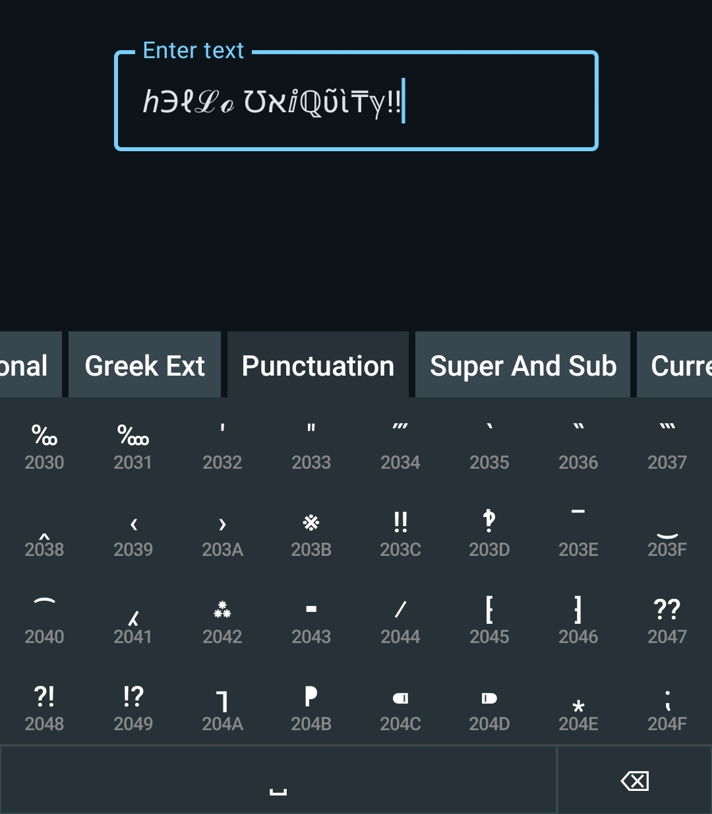

The Android keyboard with every character ever

## Overview
Uniquity is an Android keyboard that aims to have a key for every single Unicode character.

|  |
| - |

> [!WARNING]
> This keyboard is still under development and is not yet feature complete. If you're interested in furthering the development of Uniquity, feel free to open an issue or pull request.
>
> In the meantime, consider watching the repository to stay updated on progress.

## Building
For the best experience, use Android Studio to build the project. Uniquity was built on version 2025.1.2, other versions are not guaranteed to work.

This repository does not include the full Unicode Character Database (UCD) because it is very large. Although it is possible to run the app without a database, it will not let you type any characters. There are two options: generate a full database from the UCD or use the included basic database.

### Generating the Full Database from the UCD
0. Ensure you have Python 3 installed on your system with the `sqlite3` and `lxml.etree` modules available.
1. Download `ucd.all.grouped.xml` from the [Unicode Consortium](https://www.unicode.org/Public/UCD/latest/ucdxml/).
2. Place the XML file in the `migration/` directory.
3. Initialize a new SQLite database with `python init.py`.
4. Migrate the UCD into the database with `python ucd.py`.
5. Copy the generated `ucd.db` file to the `app/src/main/assets/` directory.

### Using the included Basic Database
Alternatively, you may build the app using the basic database. This database contains only a section of the ASCII unicode block. To do this:
1. Navigate to `app/src/main/java/com/sixbeeps/uniquity/data/AppDatabase.java`.
2. Locate the Room database builder and modify the `createFromAsset()` invocation to use the `basic.db` file instead of `ucd.db`.

## Installing and Using
The app bundle comes with two components: the Uniquity keyboard and a simple tester app.

To use the Uniquity keyboard, you need to enable it from your phone settings. Every phone is different, but the general idea is more or less the same. Here's the flow on my Samsung A51:
- Open the Settings app
- Navigate to
	- General management
	- Keyboard list and default
- Enable "Uniquity keyboard" and hit OK on all prompts
- Choose to either
	- Use Uniquity as the default keyboard
		- Set "Default keyboard" to Uniquity
	- Only use Uniquity when you need it
		- Enable "Keyboard button on navigation bar"
		- When typing, press the ⌨ icon in the corner and select "Uniquity keyboard"